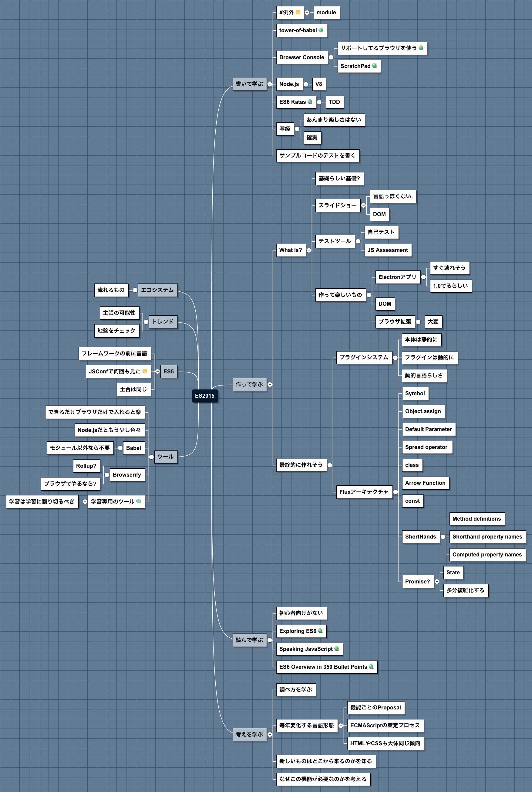

<!--
Generated by NB Mind Map Plugin (https://github.com/raydac/netbeans-mmd-plugin)
2015-12-13 23:22:47.636
-->
# ES2015

## エコシステム

### 流れるもの

## トレンド

### 主張の可能性

### 地盤をチェック

## ES5

### フレームワークの前に言語

### JSConfで何回も見た
<pre>https://www.youtube.com/watch?v=Fk_WbNrZmgA&amp;list=PL37ZVnwpeshG7ThPHHHRvPFTeU1_F_tcP&amp;index=11
https://www.youtube.com/watch?v=kGsvoAbddBY&amp;list=PL37ZVnwpeshG7ThPHHHRvPFTeU1_F_tcP&amp;index=14
</pre>

### 土台は同じ

## ツール

### できるだけブラウザだけで入れると楽

### Node\.jsだともう少し色々

### Babel

#### モジュール以外なら不要

### Browserify

#### Rollup?

#### ブラウザでやるなら?

### 学習専用のツール
*Related to: [tower\-of\-babel](#1519BB13A3AA)*  

#### 学習は学習に割り切るべき

## 書いて学ぶ

### ✘例外
<pre>Difficult things</pre>

#### module

<a name="1519BB13A3AA">
### tower\-of\-babel
> Url: [https://github\.com/yosuke\-furukawa/tower\-of\-babel](https://github.com/yosuke-furukawa/tower-of-babel)  

### Browser Console

#### サポートしてるブラウザを使う
> Url: [http://kangax\.github\.io/compat\-table/es6/](http://kangax.github.io/compat-table/es6/)  

#### ScratchPad
> Url: [https://developer\.mozilla\.org/ja/docs/Tools/Scratchpad](https://developer.mozilla.org/ja/docs/Tools/Scratchpad)  

### Node\.js

#### V8

### ES6 Katas
> Url: [http://es6katas\.org/](http://es6katas.org/)  

#### TDD

## 作って学ぶ

### What is?

#### 基礎らしい基礎?

#### スライドショー

##### 言語っぽくない\.

##### DOM

#### テストツール

##### 自己テスト

##### JS Assessment

#### 作って楽しいもの

##### Electronアプリ

###### 1. すぐ壊れそう

###### 2. 1\.0でるらしい

##### DOM

##### ブラウザ拡張

###### 1. 大変

### Fluxアーキテクチャ

#### Symbol

#### Object\.assign

#### Default Parameter

#### Spread operator 

#### class

#### Arrow Function

#### const

#### ShortHands

##### Method definitions

##### Shorthand property names

##### Computed property names

#### Promise?

### プラグインシステム

#### 本体は静的に

#### プラグインは動的に

#### 動的言語らしさ

## 読んで学ぶ

### 初心者向けがない

### Exploring ES6
> Url: [http://exploringjs\.com/](http://exploringjs.com/)  

### Speaking JavaScript
> Url: [http://speakingjs\.com/es5/](http://speakingjs.com/es5/)  

### ES6 Overview in 350 Bullet Points
> Url: [https://github\.com/bevacqua/es6](https://github.com/bevacqua/es6)  
