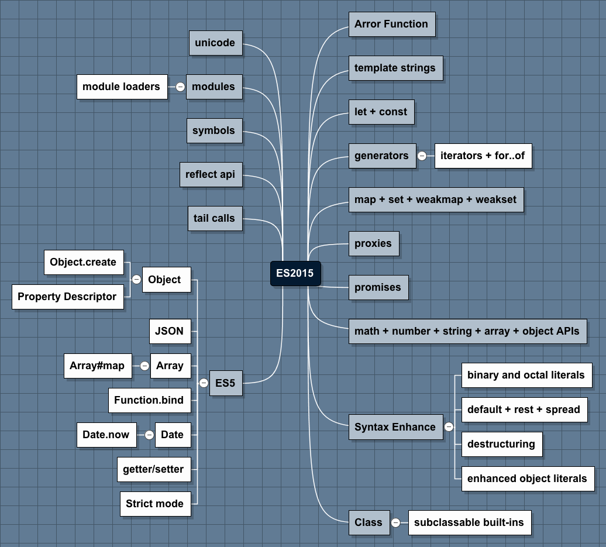

<!--
Generated by NB Mind Map Plugin (https://github.com/raydac/netbeans-mmd-plugin)
2015-12-17 18:01:07.733
-->
# ES2015

## unicode

## modules

### module loaders

## symbols

## reflect api

## tail calls

## ES5

### Object 

#### Object\.create

#### Property Descriptor

### JSON

### Array

#### Array\#map

### Function\.bind

### Date

#### Date\.now

### getter/setter

### Strict mode

## Arror Function

## template strings

## let \+ const

## generators

### iterators \+ for\.\.of

## map \+ set \+ weakmap \+ weakset

## proxies

## promises

## math \+ number \+ string \+ array \+ object APIs

## Syntax Enhance

### binary and octal literals

### default \+ rest \+ spread

### destructuring

### enhanced object literals

## Class

### subclassable built\-ins
