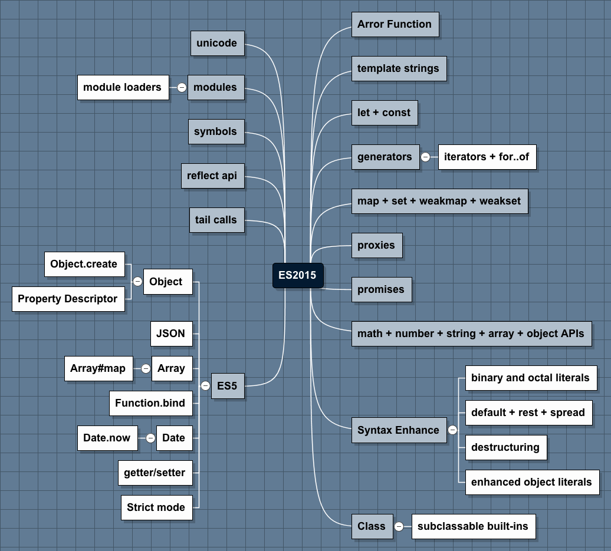

# Story

どのような順番で学ぶのか

## 目的

- 新しい要素が出てきた時に自分で仕組みを理解出来る基礎力
- なぜそういう要素が必要になったのかを考える

## ベース

他の物事を説明するために必要なこと。
つまり、他の要素から暗黙的な依存として出てくる要素

- 変数: var, let, const
- 値: プリミティブ値, オブジェクト
- 関数: function, `=>`
- メソッド
- 演算子: `+` `-` `*` `/`
- 制御文: `if`, `for`

### 学ぶ手順

- 書き方(What, Why)
- ユースケース(How, Where, When)

の2手順が基本的な流れ。

Whoは基本的に自分となり、チームとなるのはずなので最初はあんまり考えなくていいはず。
(チームでのわかりやすさを考えるなら、まず他の部分を理解してないとあんまり意味ないはずなので)

学び始める時にそれは"なに"なのかを理解し、"なぜ"必要となるのかを知る。
(ここでのWhyは言語にそれがなぜ入っているのかを伝える)

書き方が分かったところで、実際にそれを"どうやって"、"どういうとき"に、"どこ"で使うのかをユースケースと共に示す。

### どうやって

言語が大きくなるほど、"書き方"と"ユースケース"も大量になってしまうので、
それぞれを別々で考えると学ぶのが難しくなってしまう気がする。

ECMAScriptは言語としては大きいけど、基礎的な部分を基本拡張&リファクタリングして作られている。
なので、

- ES3+ES5+ES6の基礎における "書き方"と"ユースケース"
- ES5+ES6の追加オブジェクトにおける "書き方"と"ユースケース"

でわけてやるといいのではという感じがする

追加オブジェクトでまだユースケースがしっかりしていない(ECMAScript Wikiに大体は載っているけど)ものについては、
最初から学ぶべきではないと考える。
追加オブジェクトなので必要となるものがはっきり分かるまで保留。

より発展した考えとしてはTranspilerが表現可能を基礎として、追加は表現できないものとして考えることも出来る。